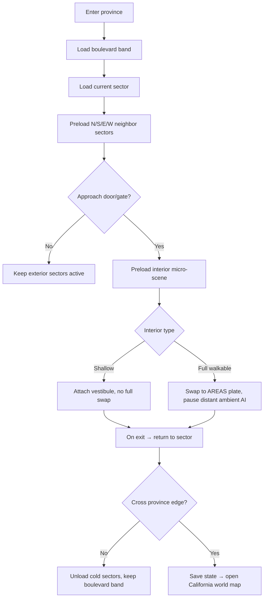

# Hollywood Province Conversion — architecture & research (adapted to our stack)

> **Status: research / production-direction, NOT implementation.** External research on converting the
> Hollywood district into a modular "province" that can scale to a California-of-provinces. This doc
> **adapts** that report to our actual stack (Vite + React 19 + **canvas-2D** billboard renderer, PWA
> for iOS/Windows/Mac) — the report's Unity/Godot/Unreal engine-selection is **moot for us** and is
> recorded only as principle, not a decision. Where it touches cultural/entity material it **defers to**
> `docs/STORY_BIBLE.md` (N/E series) and does not override it. Build nothing from this until Nelson asks.

## 0. TL;DR — how it maps to what we already have
The report's durable ideas mostly **validate + formalize** systems already in the codebase:

| Report concept | Our existing equivalent | Gap to close later |
|---|---|---|
| California world = **province tiles** | `worldDims()` + clamped camera (one board today) | a world-map layer + province registry |
| District = **streaming sectors** | the `sceneData` 8-block street grid | tag sectors + extend `prefetchArea` to sector granularity |
| Lot atom = **GSU** | procedural storefront/apartment footprints in `sceneData` | make footprint a GSU multiple, tagged |
| **Micro-interiors / threshold preload** | `AREAS` scene-swap rooms + `prefetchArea(id)` on approach | more room templates; per-sector interior registry |
| **Occluding-height plane** (walk-behind) | the single y-sort actor pass (foot-Y) | already solved |
| **Hero / mid / filler** buildings | 14 landmarks vs procedural filler | add an explicit tier tag per lot |
| **Streaming discipline / budgets** | `overworldSprite`/`bakedGlow` caches, `layoutDirty`, `decoding='async'`, FX-zoom gate | per-sector image-payload budget |
| **Interior "kits"** | baked painterly `AREAS` plates + chibi billboards (counter rule, baked host, `foreground` overlay, Leave button) | reusable plate templates, not 3D kits |

**Discard for us:** engine choice, World Partition/HLOD/Addressables specifics, AAA memory budgets, low-poly 3D interior kits. **Adopt:** the province/sector/GSU model, the building-tier tags, the **entity-location framework** (§5), and the **cultural source ladder** (§6).

## 1. Three-layer map model  [DIR]
- **Province tile** = a California world-map square. Hollywood is province #1; later Downtown LA, Long
  Beach, Malibu, San Diego, Shasta, Death Valley become other tiles. Province-edge exits route back to
  a world map. (Ours today = the single Hollywood board via `worldDims`/camera clamp; the world map is
  future work.)
- **Streaming sector** = the runtime load unit inside a province: ~one intersection + surrounding lots,
  or one linear block segment + rear access. Buildable, cullable, testable, independently budgeted.
  (Ours = slices of the `sceneData` grid; formalize a `sector` id per block band.)
- **GSU (grid-square unit)** = the exterior planning atom ≈ one small urban lot module (kiosk / narrow
  storefront bay / alley slice / driveway). 1–2 GSU = storefront; 2–4 GSU = mixed-use/apartment; 4+ GSU
  = special site. (Ours = procedural footprints; make them GSU multiples.)
- **UX rule:** the district must feel **continuous** (sector seams invisible/diegetic — camera ease,
  audio crossfade, a traffic wash to hide activation), while **province** transitions are openly the
  world map. Players tolerate explicit travel between California squares; not inside one walkable block.

## 2. Building conversion tiers — tag every lot  [DIR]
Do **not** convert every building. First pass tags each exterior lot:
- **Hero** — full interior + encounter logic. (theater, studio gate, cemetery gate, landmark hotel,
  occult shop / botanica, major clinic, municipal building, 1–3 high-drama residences.)
- **Mid-tier reusable** — modular reusable interior + bespoke dressing. (mixed-use blocks, apartments,
  corner stores, service businesses sharing an interior template.)
- **Filler shell** — decorative shell / shallow vestibule / façade-only. Its job is frontage, sightlines,
  NPC density. (the dozens of storefronts, walk-ups, garages, side offices.)
- **Background-only** — skyline pieces, inaccessible rear masses, distant hills for parallax/atmosphere.

Rationale from Hollywood's real built form: a **small number of recurring typologies** + a smaller
number of **distinctive hero exceptions** — never hundreds of unique buildings.

### Recurring filler archetypes (footprints are design GSUs, not measurements)
| Archetype | Footprint | Interior | Interactables | NPC density | Priority |
|---|---|---|---|---|---|
| Narrow storefront shell | 1×1–1×2 | none / shallow vestibule | door check, display window, flyer wall, ATM, trash, CCTV | low outside, none inside | very high |
| Corner mixed-use block | 2×2–3×2 | light reusable | shop floor, back room, upstairs stair, roof access, mailboxes | medium | very high |
| Walk-up apartment house | 2×2–3×3 | medium reusable | lobby, stair, hall, 1–2 unit layouts, laundry, roof | med-low | high |
| Courtyard apt / apt-hotel | 3×3–4×4 | med-high reusable | gate, courtyard, corridors, unit doors, manager office | medium | high |
| Studio support block | 3×3–4×4 | high modular | reception, offices, security desk, stage door, wardrobe/prop | med-high | high |
| Civic special-use shell | 3×2–5×4 | high bespoke | waiting room, counters, records room, meeting room | medium | medium |

## 3. Province schematic (aspirational north star — our current board is the H&H core only)
```
                   HOLLYWOOD PROVINCE (illustrative, not our current map)
┌────────────┬────────────┬────────────┬────────────┬────────────┐
│ Hills Edge │ Pass Trail │ View Lots  │ Park Edge  │ Hills Edge │   ← overlooks, mansions, trails
├────────────┼────────────┼────────────┼────────────┼────────────┤
│ Sunset W   │ Clubs+bars │ Theater    │ Hotel Row  │ Sunset E   │   ← nightlife / marquee density
├────────────┼────────────┼────────────┼────────────┼────────────┤
│ West Blvd  │ Tourism    │ H&H Core   │ Vine Core  │ East Blvd  │   ← ALWAYS-HOT boulevard band (ours today)
├────────────┼────────────┼────────────┼────────────┼────────────┤
│ Apartments │ Courtyard  │ Clinic +   │ Small muni │ Apartments │   ← residential / service
│ walk-ups   │ + motel    │ botanica   │ + library  │ + alleys   │
├────────────┼────────────┼────────────┼────────────┼────────────┤
│ Studio W   │ Backlot    │ Production │ Cemetery   │ Service/   │   ← slower "back-of-house", occult-capable
│ offices    │ lanes      │ offices    │ + chapel   │ loading    │
└────────────┴────────────┴────────────┴────────────┴────────────┘
exits: W/E → adjacent LA provinces · S → Long Beach/central route · N → hills/valley route
```
Production logic: **middle row = permanent boulevard band** (our current world), row above = nightlife,
row below = residential/service, bottom row = the slow occult back-of-house. Águas Douradas (Yara) sits
naturally in the "botanica" cell; the Overture court we already built is a boulevard hero site.

## 4. Art stack & interiors (mapped to our renderer)  [DIR]
- **Four-plane exterior stack** (formalizes what our passes already do): (1) **ground** — roads/
  sidewalks/curbs/crosswalks/collision (our flat ground pre-pass); (2) **frontage** — doors, windows,
  awnings, stoops, signage (our building sprites); (3) **occluding height** — lamps, palms, marquees,
  fire escapes, parapets that overlap characters (handled **free** by our foot-Y sort); (4) **skyline/
  parallax** — distant hills, tower silhouettes, haze, light beams (our backdrop/skyline plates).
- **Interiors are our AREAS plates, not 3D kits.** A reusable "kit" for us = a **painterly backdrop
  plate template + occupants + `charScale`** reusing our room conventions: the COUNTER RULE (counter
  meets a person at the waist), baked static hosts, the `foreground` overlay to hide legs, `readingBackdrop`
  state swaps, the head-on **sky** for elevated rooms, and the guaranteed **Leave** button. Threshold
  preload = `prefetchArea(id)` on approach (already built). "Player shouldn't feel the engine switch,
  just crossing a threshold" — our crossfade-through-black `startTransition` already does this.
- **Interior typologies to template** (from the research, as AREAS plates): storefront/mixed-use (front
  retail → back room → upstairs → roof); **small theater** (marquee → lobby → side hall → auditorium →
  backstage/catwalk); **residential** — keep DISTINCT: tight walk-up · inward courtyard · apartment-hotel
  w/ front desk+lounge · bungalow court w/ porches; **studio production block** (gate → office wing →
  soundstage shell → support corridor → prop/wardrobe → 1–2 backlot lanes — illusion of scale, not a real
  lot); **clinic** (vestibule → lobby → double-loaded corridor → exam/restricted zones); **municipal**
  (public counter → hearing room → records → admin → staff-only back); **cemetery** (path network,
  mausoleum interiors, chapel threshold, memorial nodes, service roads, tightly controlled sound — a
  structured ceremonial landscape, not "a spooky field").

## 5. Entity-location framework — the bridge to the entity bible  [DIR, system to build later]
Formalize five runtime classes for encounter spawners (tag = `SITE / COND / TERR / TRAV / LINEAGE`):
- **Site-bound** — strongest at a named place (cemetery chapel, spring, theater forecourt, archive room,
  a soundstage, a crosswalk). *e.g. a Molache-owned institution; a place-fixed ancestral presence.*
- **Condition-called** — appears when a spatial/temporal condition holds (crossroads, storm, midnight
  screening, funeral procession, backstage blackout). *e.g. Exu at a crossroads at the right hour.*
- **Territory-wide** — not one address; moves within a thematically coherent district. *e.g. Molache
  across LA's institutions; The Audience across the attention-city.*
- **Traveler** — deliberately crosses districts, ignores local ownership. *e.g. **Lucifer** — "kingdoms
  require borders; I prefer doors."*
- **Lineage-called** — contact depends on custodial relationship / tradition / invitation / kinship /
  restricted criteria. *e.g. Indigenous & Afro-diasporic gated beings — this class is the **culturally
  safe** way to model restricted traditions without flattening them into spawnable bosses.*

**Progression / danger / failure hooks** (ties to the future soul skill-tree, Axé/chakra, Sacrificial
Logic): early game — perceive/overhear/accidentally trigger condition-called phenomena, can't safely
compel; mid — partial summoning/negotiation tied to place + materials + timing; late — intentionally
route through dangerous sites, carry consequences across provinces, survive entity-specific retaliation.
**Failure states must exceed HP loss:** social contamination, debt, fear markers, reputation shifts,
missing time, false information, broken wards, or being barred from a site until restitution. This keeps
summoning from collapsing into "press button → spawn boss," which is also the culturally safer design.

**NPC placement = frontage logic, not random scatter:** dense ambient NPCs at marquee edges, storefront
entrances, lobbies, reception desks, queues, crossings, courtyard gates, cemetery paths; sparse persistent
NPCs in courts/alleys/rooftops/staff corridors. Time-of-day + event-state overlays: the same block reads
touristic at noon, predatory at midnight, bureaucratic at 9am (we already have the day-night clock).

## 6. Cultural research protocol & fictionalization  [RESEARCH — defers to STORY_BIBLE.md]
This **operationalizes** (does not override) the Story-Bible cultural rules (never merge traditions;
never invent a secret "true mythology"; Puvungna is a living sacred place; research/consultation-gated).
Adds a concrete **source ladder** + provenance discipline:

**Source ladder (in priority order):**
1. **Tribal official / tribal-submitted pages** — NAHC Digital-Atlas tribal pages, the Fernandeño
   Tataviam Band's own site, Gabrielino/Tongva Springs Foundation (Kuruvungna), CSU Long Beach
   stewardship pages for Puvungna. Best for current public-facing significance + community-approved language.
2. **State / federal official pages** — NAHC, NPS (e.g. the Chumash Rainbow Bridge material for Hutash /
   Alchupo'osh / Limuw, attributed to a Chumash elder), university stewardship pages, LA Office of
   Historic Resources / SurveyLA. Strong for geography, built form, public interpretive content.
3. **Peer-reviewed scholarship** — comparative context, typology, mission-era records; treat older
   ethnographies as incomplete, mission-shaped, colonial/salvage-filtered.
4. **Primary historical sources** — archives, Sanborn maps, NRHP nominations, historic-context statements.
   Excellent for architecture/streetscape; **unreliable as sole arbiters of living sacred knowledge**.

> Draw theater-façade proportions from historic surveys; draw Indigenous spiritual logic ONLY from tribal
> and official Native-facing sources. The **NAHC explicitly warns the Digital Atlas is educational-only,
> not a territorial authority**, and stresses tribal control + harm prevention + caution around
> culturally significant locations.

**Restricted material — hard NO:** do not systematize exact rites, non-public sacred names, burial
procedures, precise sacred-site locations beyond what public custodians publish, or lineage-specific
ritual mechanics. Public *significance / stewardship / access conditions / broad thematic frames* are
usable; **fictionalize the rest.**

**Fictionalize-when rubric (any one triggers it):** public documentation is thin · the tradition is
living & sensitive · communities disagree · the source chain is mission-era/colonial only · a mechanic
would require explicit ritual replication · an encounter would flatten a community-specific being into
generic combat. When fictionalizing, mark the entity **"inspired by," never "adapted from,"** and record
the provenance in the design doc. (Aligns with the entity-bible's `[RESEARCH]` gates and the
lineage-called class in §5.)

## 7. Streaming & performance — for a canvas PWA (not AAA)  [DIR]
- **Stream by SECTOR, never by building.** Keep the current sector + immediate neighbors + an
  **"always-warm boulevard band"** around the player's longitude (the boulevard is the nav spine).
  Interiors use **threshold-based preload** on door/desk approach. *For us this is `prefetchArea` extended
  to sector chunks + the existing enterables prefetch.*
- **Our real budget is image-decode memory + JS heap + PWA precache**, not 800 MB VRAM. Keep per-sector
  image payloads small; lean on `overworldSprite` (pre-scaled cache), `bakedGlow`, `patternMatrix`,
  `spriteBounds`, `layoutDirty`, `decoding='async'`, and FX-zoom gating — all already built. Distant filler
  = atlased cards / merged draws; full detail only for hero frontage + interiors.
- **Transition hierarchy:** sector = diegetic (camera ease + audio crossfade + short hitch buffer, maybe
  a traffic wash); interior = diegetic threshold (door/gate/reception/backstage checkpoint — our
  `startTransition` fade); province = explicit (world-map overlay / travel cutaway / county-line banner).



## 8. Naming & tooling conventions  [DIR]
Asset/lot naming so tiers + sectors + encounter classes are searchable in tooling and design docs:
```
[Province]_[Sector]_[Block]_[Archetype]_[Variant]_[Purpose]_[LOD]
HWD_S02_B11_MIXCORNER_A_EXT           HWD_S02_B11_MIXCORNER_A_INT_SHOP
HWD_S04_B03_THEATER_HERO_AUD          HWPROV_WMAP_EXIT_EAST
```
Encounter spawners tagged with the §5 classes: `SITE / COND / TERR / TRAV / LINEAGE`. (Adapt to our
repo layout — this is a convention, not a required folder move.) Backing tools we actually need: a
sector/lot table (spreadsheet or JSON), encounter tables, an atlas/texture pipeline (we key/crop via
Playwright+canvas already), a room-template library (AREAS entries), and an asset registry. No exotic
middleware before a stable Hollywood province.

## 9. Phased roadmap (re-based on our stack — no engine migration)  [DIR]
| Phase | Outcome | Our-stack tasks |
|---|---|---|
| Foundation | province/sector/GSU spec + tiers + encounter ontology locked | define GSU, sector bounds, province exits, tier tags, naming, save-state schema |
| Exterior sectorization | boulevard split into reusable sectors + filler shells | slice `sceneData` into sectors, façade kit, rear/background masses, extend `prefetchArea` to a warm boulevard band |
| First interior templates | reusable walkable AREAS plates | storefront/mixed-use/apartment/clinic/office plate templates + door-threshold `startTransition` |
| Hero-site pass | landmark depth | theater + studio + cemetery + one civic building AREAS + unique interactables |
| Population/encounter layer | district feels inhabited | frontage NPC heatmap, queue nodes, worker schedules, condition-called triggers, day-state overlays |
| Cultural-systems pass | safety + lore rigor | provenance fields (source ladder + inspired-by/adapted-from), sensitive-content review, restricted-mechanic flags |
| Province travel | California loop | province-edge exits, world-map layer, save/load handoff |
| Optimization | first shippable district | profile sector loads, atlas/compress, reduce draws, pool crowd/props |

**Early sprint order (bias to visible progress):** A freeze grid + tag lots hero/mid/filler · B convert
the boulevard into 5–7 sectors + shell buildings behind frontage · C build the mixed-use/storefront/
walk-up interior template + door thresholds · D theater hero interior + a cemetery mini-path · E NPC
frontage heatmaps + district time states + one condition-called encounter · F province-edge exits +
world-map handoff.

## 10. The one takeaway
**Treat Hollywood as the pipeline laboratory, not just the first map.** If the province schema, tier
tags, entity-location classes, and cultural-source protocol work here, they generalize to Downtown,
Long Beach, Malibu, Shasta, Death Valley. If they don't work here, California only gets bigger, not better.

## Sources (external research; citation tokens stripped)
NRHP Hollywood Boulevard Commercial & Entertainment District nomination · LA Office of Historic Resources
/ SurveyLA historic-context statements (commercial, residential, theaters, industrial/studio) · FilmLA
(backlot definition) · NPS Chumash "Rainbow Bridge" interpretive material · California Native American
Heritage Commission (Digital Atlas + internal memo on educational-use/tribal-control/harm-prevention) ·
Hollywood Forever cemetery (lawn-park findings + current site functions) · CSU Long Beach Puvungna
stewardship · Gabrielino/Tongva Springs Foundation (Kuruvungna) · Fernandeño Tataviam Band official site ·
medical-office & municipal/civic-center planning references · Unity / Unreal / Godot streaming & 2D/2.5D
docs (recorded as principle only — not our engine).

---
> Research/direction only. No sectorization, streaming rework, interiors, encounter systems, or cultural
> adaptation is built from this until Nelson explicitly requests it. Cultural/entity content defers to
> `docs/STORY_BIBLE.md`.
